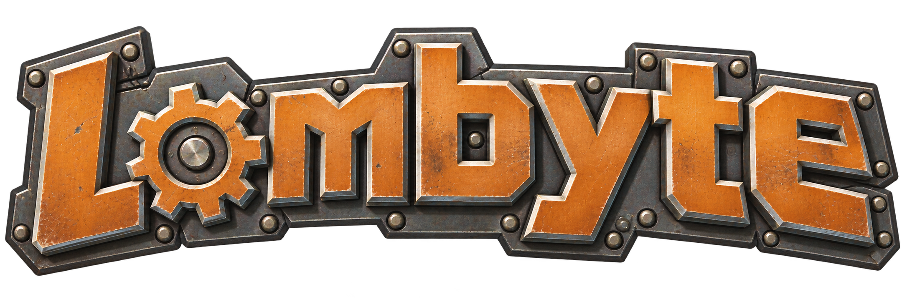

<p align="center">
  
</p>

<h1 align="center">Ratchet &amp; Clank Decompilation</h1>

<p align="center">
  A work-in-progress matching decompilation of Ratchet &amp; Clank (2002) for PlayStation 2.<br>
  The project is under active development: incomplete areas and bugs are expected.
</p>

<p align="center">
  <a href="#decompilation-progress">Progress</a> ·
  <a href="#supported-version">Supported version</a> ·
  <a href="#building">Building</a> ·
  <a href="#contributing">Contributing</a> ·
  <a href="#credits">Credits</a>
</p>

> [!WARNING]
> Do not use this decompilation project without your own legally purchased copy of the game. Lombyte includes no game data, executables, or proprietary toolchains, so you must provide your own legitimately obtained PS2 copy. Only the **USA / NTSC-U** release (`SCUS_971.99`) is supported — PAL, NTSC-J, and the later PS3 remaster are not.

## About

**Lombyte** is a non-commercial research and preservation project. It reconstructs the game's Emotion Engine (EE) executable as readable C that compiles to the same machine code as the original USA release (`SCUS_971.99`), verified byte-for-byte against retail.

The long-term goal is a **PC runtime**: a native program that runs the game on modern hardware. Reconstructing the executable's interfaces, data layouts, ABIs, and behavior is the groundwork for it.

## Decompilation Progress


Each tile is one configured C unit, sized by its share of the executable's code bytes. **Orange** tiles are matching C, **chrome** tiles are intentional low-level asm (SIMD/VU0 helpers excluded from the C goal), and **dark steel** tiles are C still pending. Rebuild the map locally with:

```sh
.venv/bin/python scripts/generate_treemap.py
```

After a baseline build, pass `--workspace build/baseline` to also measure the pending C bodies and report C_FUZZY alongside C_EXACT.

Percentages cover the configured code in the boot executable, not the entire disc. Its embedded DVP overlay blobs are rebuilt as raw data; overlays or executables elsewhere on the disc are out of scope. The map's classification input is `config/us/unit_categories.json`.

A matching executable does not mean the decompilation is complete. Unconverted
units keep using assembly or raw machine-code _oracles_ to preserve the
original bytes; matching C replaces them over time. The oracles are generated
at build time from your own `config/us/SCUS_971.99` into the gitignored
`config/us/expected/asm/` tree; the repository stores none.

Matching is verified at two levels: objdiff per compiled object, and a
whole-ELF comparison against the original (SHA-256 below).

## Supported version

| Game                   | Platform      | Region       | Boot executable |
| :--------------------- | :------------ | :----------- | :-------------- |
| Ratchet & Clank (2002) | PlayStation 2 | USA / NTSC-U | `SCUS_971.99`   |

Expected **SHA-256 of the boot executable** (not the ISO):

```text
e050581032e4bb3f20341307da5b69b76f1574910519155380ea771e55c3c0c9
```

## Building

### 1. Prepare the build tools

The verified environment is Linux/WSL: the SN compiler is a Windows executable and must be runnable, so a plain Linux setup is not enough by itself.

Install Git, Make, Bash, Python 3 with virtual-environment support, and the following tools:

| Tool                                                | Required location or configuration                                                     |
| :-------------------------------------------------- | :------------------------------------------------------------------------------------- |
| EE-GCC `2.9-ee-991111-01`                           | `tools/compilers/ee-gcc2.9-991111-01/`                                                 |
| SN EE-GCC `2.95.2`                                  | `tools/compilers/ee-gcc-2.95.2/` (including `bin/ee-gcc.exe` and its supporting tools) |
| R5900 binutils                                      | `mips-ps2-decompals-*` executables; set `BINUTILS_ROOT` to their directory             |
| [objdiff CLI](https://github.com/encounter/objdiff) | `tools/objdiff/objdiff-cli`                                                            |
| Ninja and Python build dependencies                 | Installed into `.venv` below                                                           |

Compiler versions matter for matching. Preserve the directory layouts and executable permissions; toolchain binaries are not downloaded.

A few units were matched with an optional patched EE-GCC profile. `make elf` does not need it — those units fall back to the retail oracle — but install it to work on their C:

```sh
python3 scripts/build-patched-toolchain.py
export EE_GCC_PATCHED_ROOT="$PWD/tools/ee-gcc2.9-991111-01-patched"
```

See [docs/patched-toolchain.md](docs/patched-toolchain.md).

From your checkout, for example `~/Lombyte`:

```sh
cd ~/Lombyte
python3 -m venv .venv
.venv/bin/python -m pip install -r requirements.txt

# Point this at your installed R5900 binutils.
export BINUTILS_ROOT="$HOME/tools/binutils-mips-ps2-decompals"
```

Use the versions in [requirements.txt](requirements.txt); spimdisasm is pinned to match the expected disassembly.

### 2. Supply the original game files

Extract `SCUS_971.99` from the root of your USA disc image and place it at:

```text
config/us/SCUS_971.99
```

Verify it against the hash in [Supported version](#supported-version):

```sh
sha256sum config/us/SCUS_971.99
```

For an ISO rebuild, also place your original disc image at `dumps/game.iso` (create `dumps/` if needed). These inputs are ignored by Git.

### 3. Build the executable

```sh
make elf
```

The build stages the sources, splits the reference executable, prepares assembly-backed units, compiles and links the code, generates an objdiff report, and verifies the reconstructed executable against retail.

The default staging directory is `build/baseline` inside the checkout. **It is recreated on each run.** If the checkout is on a Windows-mounted drive (`/mnt/c/...`), set `BASELINE_ROOT` to a native Linux directory such as `$HOME/rnc-baseline` so the frozen 32-bit compiler works on a local filesystem.

| Output                   | Default location                                  |
| :----------------------- | :------------------------------------------------ |
| Reconstructed boot ELF   | `build/baseline/config/us/build/SCUS_971.99`      |
| Object comparison report | `build/baseline/config/us/report.json`            |

A successful run ends with:

```text
PASS: reconstructed boot ELF matches retail
baseline build OK
```

### 4. Rebuild a disc image

```sh
make iso
```

This rebuilds the executable, then patches it into a copy of the first `dumps/*.iso` found. Keep one input ISO in that directory to make selection unambiguous.

The output is written to:

```text
build/Ratchet & Clank (USA) - rebuilt.iso
```

The original disc image is preserved. With a byte-identical boot ELF, the rebuilt image matches your original.

<details>
<summary><strong>Build configuration</strong></summary>

The build and ISO scripts support these environment overrides. Use absolute paths for custom tool and staging locations.

| Variable              | Default / usage                                                          |
| :-------------------- | :----------------------------------------------------------------------- |
| `VENV`                | `.venv` in the checkout                                                  |
| `BASELINE_ROOT`       | `build/baseline` in the checkout; disposable staging directory           |
| `BINUTILS_ROOT`       | Set to the directory containing your `mips-ps2-decompals-*` tools        |
| `EE_GCC_PATCHED_ROOT` | Optional patched EE-GCC profile                                          |
| `COMPILER_ROOT`       | `tools/compilers` in the checkout                                        |
| `SN_TOOLCHAIN_ROOT`   | `tools/compilers/ee-gcc-2.95.2` in the checkout                          |

For example:

```sh
# Override only when the checkout is on a Windows-mounted drive.
export BASELINE_ROOT="$HOME/rnc-baseline"
export BINUTILS_ROOT="$HOME/tools/binutils-mips-ps2-decompals"
make elf
```

To patch an already-built ELF with explicit input and output paths:

```sh
python3 rebuild-iso.py \
  --iso dumps/game.iso \
  --elf "$BASELINE_ROOT/config/us/build/SCUS_971.99" \
  --out build/rebuilt.iso
```

</details>

## Repository layout

| Path                             | Contents                                                              |
| :------------------------------- | :-------------------------------------------------------------------- |
| [`src/`](src/)                   | Reconstructed C, including matching and work-in-progress units        |
| [`src/assembly/`](src/assembly/) | Assembly-backed units that preserve the original code                 |
| [`include/`](include/)           | Shared types, structures, and declarations                            |
| [`config/`](config/)             | Executable layout, symbol maps, and analysis exports                  |
| [`scripts/`](scripts/)           | Build and contribution helpers                                        |
| [`patches/`](patches/)           | Source patch for the optional patched EE-GCC profile                  |
| [`docs/`](docs/)                 | Workflow and reference documentation                                  |
| [`assets/`](assets/)             | Lombyte emblem and generated progress map                             |
| [`tools/`](tools/)               | Locally installed compilers and comparison tools (not tracked by Git) |
| [`dumps/`](dumps/)               | Local input disc images, ignored by Git                               |
| [`build/`](build/)               | Local ISO output and the baseline workspace, ignored by Git           |

## Contributing

Contributions are welcome: matching C, recovered names, types, and documentation. [CONTRIBUTING.md](CONTRIBUTING.md) has the full walkthrough; in short: build the baseline with `make elf`, pick a unit with `python3 scripts/list-functions.py --score`, refine it with `python3 scripts/check-unit.py <unit>`, then promote it and open a pull request with the `PASS` output.

Work-in-progress C is welcome too: keep the oracle, make sure `make elf` still passes, and describe the remaining mismatch in the pull request. For build issues, include your operating system, tool versions, command, and relevant error output. Supply hashes and logs rather than game images or proprietary compiler binaries.

## Credits

- **[Himuro](https://github.com/Mikompilation/Himuro)** — for insight into the PS2 decompilation process and the reference EE-GCC toolchain work this project's matching compiler profiles build on.
- **[bordplate/RC1](https://codeberg.org/bordplate/RC1)** — a dormant matching-decompilation skeleton for the same game; its recovered symbol names and structure were used as reference, with attribution. The derived mapping lives in [`config/us/recovered_names.json`](config/us/recovered_names.json), [`config/us/symbol_addrs_recovered.txt`](config/us/symbol_addrs_recovered.txt), and [`docs/recovered-names.md`](docs/recovered-names.md).
- **[splat](https://github.com/ethteck/splat)** and **[spimdisasm](https://github.com/Decompollaborate/spimdisasm)** — executable splitting and disassembly.
- **[objdiff](https://github.com/encounter/objdiff)** — object-level comparison.
- The PS2 reverse-engineering and decompilation communities for the tools and research that make matching projects possible.

## License

Repository code is distributed under the [MIT License](LICENSE); the license covers the project's own tooling and documentation. Code reconstructed from third-party binaries remains the sole intellectual property of the respective copyright holders — see [THIRD_PARTY_NOTICES.md](THIRD_PARTY_NOTICES.md).

The Lombyte emblem in [`assets/`](assets/) is the project's original artwork.
