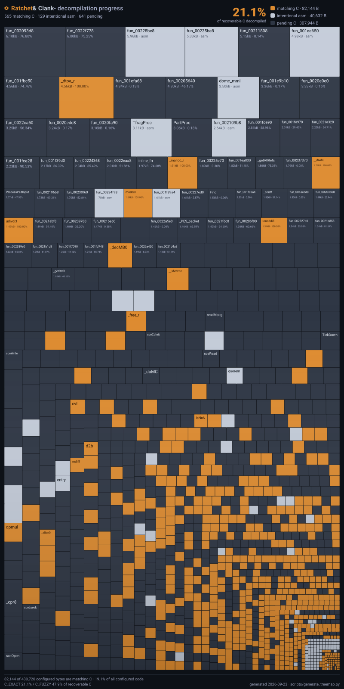

<p align="center">
  
</p>

<h1 align="center">Ratchet &amp; Clank Decompilation</h1>

<p align="center">
  A work-in-progress matching decompilation of Ratchet &amp; Clank (2002) for PlayStation 2.
</p>

<p align="center">
  <a href="#decompilation-progress">Progress</a> ·
  <a href="#supported-version">Supported version</a> ·
  <a href="#building">Building</a> ·
  <a href="#contributing">Contributing</a> ·
  <a href="#credits">Credits</a>
</p>

## About

**Lombyte** aims to reconstruct the game's Emotion Engine (EE) executable as readable C that compiles to the same machine code as the original release. Matching source, recovered symbols, shared types, and assembly-backed code are developed together, with byte-for-byte verification against the original executable.

The current target is the **USA / NTSC-U boot executable, `SCUS_971.99`**. The build reconstructs this executable and can patch it into a copy of an original disc image, preserving the remaining disc data.

You will need your own copy of the game to supply the original executable and disc image. Game images and compiler binaries are not included in this repository.

## Decompilation Progress



Each tile is one configured C unit, sized by its share of the executable's code bytes. **Green** tiles are matching C; **blue** tiles are intentional low-level asm (SIMD/VU0 helpers kept as assembly and excluded from the C goal); **dark grey** tiles are C still pending. The map is regenerated at the end of every decompilation pipeline run; regenerate it locally with:

```sh
.venv/bin/python scripts/generate_treemap.py
```

**Decompilation snapshot — September 9, 2026**

| Measure | Status |
| :--- | :--- |
| Matching C functions | **325** — approximately **24.0%** of configured functions |
| Matching C code size | **33,976 bytes** — **7.889%** of configured code bytes |
| Boot executable reconstruction | **Byte-identical to the supported retail ELF** |
| Disc rebuild smoke check | **Byte-identical to the input disc image** |

The table is a dated snapshot; the map above is regenerated by CI on every push to `main`. Percentages describe the configured code in the boot executable, not the entire disc or all game content.

**A matching executable does not mean the decompilation is complete.** Unconverted units still use assembly or raw machine-code representations (called *oracles*) to preserve the original bytes. Progress increases as those units are replaced with matching, readable C.

The build uses two complementary checks:

- **Per-unit comparison:** objdiff compares compiled objects with their reference objects to inspect code and data matching.
- **Whole-executable verification:** the build compares the reconstructed boot ELF with the original. The supported executable's SHA-256 is listed below.

## Supported version

| Game | Platform | Region | Boot executable |
| :--- | :--- | :--- | :--- |
| Ratchet & Clank (2002) | PlayStation 2 | USA / NTSC-U | `SCUS_971.99` |

Expected **SHA-256 of the boot executable** (not the ISO):

```text
e050581032e4bb3f20341307da5b69b76f1574910519155380ea771e55c3c0c9
```

This is a matching reconstruction project targeting the original PS2 executable. A native PC port is outside the current scope.

## Building

### 1. Prepare the build tools

The verified build environment is Linux/WSL with support for both the frozen 32-bit Linux EE compiler and the Windows PE SN compiler. A Linux installation alone does not provide Windows executable support; the SN driver must be runnable in your environment.

Install Git, Make, Bash, Python 3 with virtual-environment support, and the following tools:

| Tool | Required location or configuration |
| :--- | :--- |
| EE-GCC `2.9-ee-991111-01` | `tools/compilers/ee-gcc2.9-991111-01/` |
| SN EE-GCC `2.95.2` | `tools/compilers/ee-gcc-2.95.2/` (including `bin/ee-gcc.exe` and its supporting tools) |
| R5900 binutils | `mips-ps2-decompals-*` executables; set `BINUTILS_ROOT` to their directory |
| [objdiff CLI](https://github.com/encounter/objdiff) | `tools/objdiff/objdiff-cli` |
| Ninja and Python build dependencies | Installed into `.venv` below |

Compiler versions matter for matching. Preserve the compiler directory layouts and executable permissions when installing them. Toolchain binaries must be supplied separately; the build does not download them.

From your checkout, for example `~/Lombyte`:

```sh
cd ~/Lombyte
python3 -m venv .venv
.venv/bin/python -m pip install -r requirements.txt

# Point this at your installed R5900 binutils executables.
export BINUTILS_ROOT="$HOME/tools/binutils-mips-ps2-decompals"
```

Use the versions in [requirements.txt](requirements.txt), including the pinned spimdisasm version, to reproduce the expected disassembly output.

### 2. Supply the original game files

Extract `SCUS_971.99` from the root of your USA disc image using an ISO extraction tool, and place it at:

```text
config/us/SCUS_971.99
```

Verify it against the hash in [Supported version](#supported-version):

```sh
sha256sum config/us/SCUS_971.99
```

For an ISO rebuild, also place your original disc image at `dumps/game.iso`. Create `dumps/` if needed. These inputs are ignored by Git.

### 3. Build the executable

```sh
make elf
```

The build stages the sources, splits the reference executable, prepares assembly-backed units, compiles and links the code, generates an objdiff report, and verifies the reconstructed executable against retail.

The default staging directory is `~/rnc-baseline`. **It is recreated on each run**, so use a dedicated build directory when overriding it.

| Output | Default location |
| :--- | :--- |
| Reconstructed boot ELF | `~/rnc-baseline/config/us/build/SCUS_971.99` |
| Object comparison report | `~/rnc-baseline/config/us/report.json` |

A successful run ends with:

```text
PASS: reconstructed boot ELF matches retail
baseline build OK
```

### 4. Rebuild a disc image

```sh
make iso
```

This first rebuilds the executable, then patches it into a copy of the first `dumps/*.iso` found. Keep one input ISO in that directory to make selection unambiguous.

The output is written to:

```text
build/Ratchet & Clank (USA) - rebuilt.iso
```

The original disc image is preserved. With a byte-identical boot ELF, the rebuilt ISO is also byte-identical to the input image.

<details>
<summary><strong>Build configuration</strong></summary>

The build and ISO scripts support these environment overrides. Use absolute paths for custom tool and staging locations.

| Variable | Default / usage |
| :--- | :--- |
| `VENV` | `.venv` in the checkout |
| `BASELINE_ROOT` | `~/rnc-baseline`; dedicated, disposable staging directory |
| `BINUTILS_ROOT` | Set to the directory containing your `mips-ps2-decompals-*` tools |
| `COMPILER_ROOT` | `tools/compilers` in the checkout |
| `SN_TOOLCHAIN_ROOT` | `tools/compilers/ee-gcc-2.95.2` in the checkout |

For example:

```sh
export BASELINE_ROOT="$HOME/rnc-baseline"
export BINUTILS_ROOT="$HOME/tools/binutils-mips-ps2-decompals"
make elf
```

To patch an already-built ELF with explicit input and output paths:

```sh
python3 rebuild-iso.py \
  --iso dumps/game.iso \
  --elf "$BASELINE_ROOT/config/us/build/SCUS_971.99" \
  --out build/rebuilt.iso
```

</details>

## Repository layout

| Path | Contents |
| :--- | :--- |
| [`src/`](src/) | Reconstructed C, including matching and work-in-progress units |
| [`src/assembly/`](src/assembly/) | Assembly-backed units that preserve the original code |
| [`include/`](include/) | Shared types, structures, and declarations |
| [`config/`](config/) | Executable layout, symbol maps, and analysis exports |
| [`scripts/`](scripts/) | Build-support helpers and the progress-map generator |
| [`analysis/`](analysis/) | Audit snapshots and progress evidence |
| [`assets/`](assets/) | README logo and generated progress map |
| `tools/` | Locally installed compilers and comparison tools (not tracked by Git) |
| `dumps/` | Local input disc images, ignored by Git |
| `build/` | Local ISO output, ignored by Git |

## Contributing

Contributions are welcome, from matching functions and recovering names to improving types, documentation, and build reproducibility.

For code contributions:

1. Start with a reproducible baseline using the supported executable and compiler versions.
2. Keep changes focused and follow the surrounding source and naming conventions.
3. Compare affected objects with objdiff and run `make elf` before submitting.
4. Include the affected functions, matching results, and full-build verification in your pull request. Clearly identify any work-in-progress code.

For build issues, include your operating system, tool versions, command, and relevant error output. Supply hashes and logs rather than game images or proprietary compiler binaries.

## Credits

- **Insomniac Games** — the original Ratchet & Clank.
- **[splat](https://github.com/ethteck/splat)** and **[spimdisasm](https://github.com/Decompollaborate/spimdisasm)** — executable splitting and disassembly.
- **[objdiff](https://github.com/encounter/objdiff)** — object-level comparison.
- The PS2 reverse-engineering and decompilation communities for the tools and research that make matching projects possible.

## License

Repository code is distributed under the [MIT License](LICENSE). The original game's assets, logo, and trademarks belong to their respective owners and are not covered by this license. This is an independent community project, unaffiliated with Insomniac Games or Sony Interactive Entertainment.

Logo image hosted by [Wikimedia](https://upload.wikimedia.org/wikipedia/it/3/32/Ratchet_%26_Clank_logo.png).
